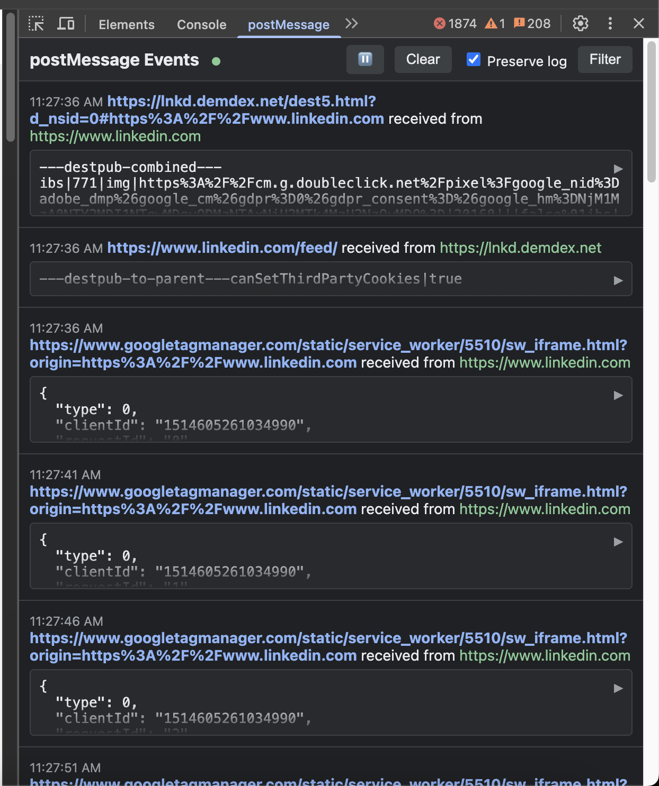

# postMessage Dev Tools Chrome Extension

<div align="center">


[](https://opensource.org/licenses/MIT)
[](CONTRIBUTING.md)
[](https://github.com/oferlmntr/post-message-devtool/issues)
[](https://github.com/oferlmntr/post-message-devtool/stargazers)

A Chrome DevTools extension for monitoring and debugging postMessage events on web pages. Built with Manifest V3.

[Installation](#installation) • [Features](#features) • [Screenshots](#screenshots) • [Usage](#usage) • [Developer Guide](#developer-guide) • [Contributing](#contributing)

</div>

## 🚀 Features

- **Dedicated DevTools Panel**: View postMessage events in a specialized panel within Chrome DevTools
- **Real-time Monitoring**: Capture and display postMessage events as they occur
- **Syntax Highlighting**: JSON data is nicely formatted with color-coded syntax highlighting
- **Collapsible JSON**: View a compact summary by default, expand to see full details
- **Structured Display**: View message source, origin, and data in a clean, organized format
- **Preserve Log Option**: Keep message history when navigating between pages
- **Dark Mode Support**: Automatically adapts to your browser's dark/light mode preference
- **Advanced Filtering**: Filter messages by origin or content to find relevant information
- **Manifest V3 Compatible**: Uses the latest Chrome extension format

## 📸 Screenshots



## 🔧 Installation

### From Chrome Web Store (Coming Soon)

The extension will be available in the Chrome Web Store soon.

### From Source (Development)

1. Clone this repository:
   ```
   git clone https://github.com/oferlmntr/post-message-devtool.git
   ```

2. Open Chrome and navigate to `chrome://extensions/`

3. Enable "Developer mode" by toggling the switch in the top-right corner

4. Click "Load unpacked" and select the directory containing the extension

5. The extension is now installed! Open DevTools (F12 or Cmd+Opt+I on Mac) and look for the "postMessage" tab

## 📖 Usage

1. Open Chrome DevTools on any webpage (F12 or Cmd+Opt+I on Mac)
2. Navigate to the "postMessage" tab
3. As postMessage events occur on the page, they will appear in the panel
4. Use the controls at the top to:
   - Clear the current messages
   - Toggle "Preserve log" to keep messages when navigating
   - Open the filter panel to find specific content

## 🧑‍💻 Developer Guide

### Project Structure

```
postMessage-DevTools/
├── js/                      # JavaScript source files
│   ├── background.js        # Service worker for message handling
│   ├── content-script.js    # Content script injected into pages
│   ├── panel.js             # DevTools panel functionality
│   ├── devtools.js          # DevTools integration
│   ├── code.js              # Syntax highlighting functionality
│   └── postMessage-debugger.js  # Helper utilities
├── images/                  # Extension icons
├── docs/                    # Documentation assets
├── test-page/               # Test pages for development
├── devtools.html            # DevTools page HTML
├── panel.html               # Panel UI HTML
├── popup.html               # Extension popup HTML
├── manifest.json            # Extension manifest
└── README.md                # This file
```

### Key Components

#### 1. Content Script (`js/content-script.js`)
- Injected into every web page
- Overrides the native `window.postMessage` and `window.addEventListener` methods
- Captures all postMessage events and sends them to the background service worker
- Handles disconnections and reconnections with the background service worker
- Maintains a message queue when the background service worker is unavailable

#### 2. Background Service Worker (`js/background.js`)
- Serves as the central communication hub
- Manages connections with the DevTools panel
- Maintains message history for each tab
- Persists message history to storage
- Processes and forwards messages from content scripts to relevant DevTools panels
- Implements a keep-alive mechanism to prevent service worker termination

#### 3. DevTools Integration (`js/devtools.js` & `devtools.html`)
- Creates a custom DevTools panel
- Establishes connection with the background service worker

#### 4. Panel UI (`panel.html` & `js/panel.js`)
- Displays captured postMessage events
- Implements filtering and searching functionality
- Provides controls for clearing history and toggling preserve log
- Handles formatting and display of message data
- Supports dark/light mode
- Implements syntax highlighting and collapsible JSON

### Main Flow Diagram

```
┌─────────────────┐                  ┌─────────────────┐                  ┌─────────────────┐
│                 │                  │                 │                  │                 │
│   Web Page      │                  │  Background     │                  │  DevTools       │
│   (Content      │                  │  Service        │                  │  Panel          │
│    Script)      │                  │  Worker         │                  │                 │
│                 │                  │                 │                  │                 │
└────────┬────────┘                  └────────┬────────┘                  └────────┬────────┘
         │                                    │                                    │
         │ 1. Override native postMessage     │                                    │
         │    and event listeners             │                                    │
         │                                    │                                    │
         │ 2. Capture postMessage event       │                                    │
         │                                    │                                    │
         │ 3. Send event to background        │                                    │
         │    ──────────────────────────────▶ │                                    │
         │                                    │ 4. Store message in history        │
         │                                    │                                    │
         │                                    │ 5. Forward to DevTools panel       │
         │                                    │    (if connected)                  │
         │                                    │    ──────────────────────────────▶ │
         │                                    │                                    │ 6. Display message
         │                                    │                                    │    in panel UI
         │                                    │                                    │
         │                                    │ 7. Persist message history         │
         │                                    │    to storage                      │
         │                                    │                                    │
         │                                    │                                    │ 8. User interacts with
         │                                    │                                    │    panel (filter, clear)
         │                                    │                                    │
         │                                    │ 9. Panel sends commands            │
         │                                    │ ◀ ─────────────────────────────── │
         │                                    │                                    │
         │                                    │ 10. Background processes           │
         │                                    │     commands and updates           │
         │                                    │     panel                          │
         │                                    │     ─────────────────────────────▶ │
         ▼                                    ▼                                    ▼
```

### Message Format

Messages are captured and stored in the following format:

```javascript
{
  source: "window" | "iframe",  // Source of the message
  sourceUrl: String,            // URL of the source window/frame
  targetUrl: String,            // URL of the target window/frame
  origin: String,               // Origin specified in postMessage
  data: Any,                    // The message data
  timestamp: Number,            // When the message was sent
  tabId: String                 // ID of the tab where the message occurred
}
```

### Resilience Features

The extension implements several resilience mechanisms:

1. **Message Queueing**: Content scripts queue messages if the background service worker is unavailable
2. **Reconnection Logic**: Automatic reconnection with exponential backoff
3. **State Persistence**: Message history is saved to storage and reloaded when needed
4. **Keep-Alive**: Background service worker implements keep-alive mechanisms to prevent termination
5. **Error Handling**: Robust error handling throughout to manage Chrome extension lifecycle events

### Adding New Features

When adding new features, consider the following:

1. **Content Script Changes**: Modifications to event capturing logic
   - Update `content-script.js` for changes to how postMessage events are intercepted
   - Be careful with performance impact as content scripts run on every page

2. **Background Logic**: Enhancements to message processing or storage
   - Update `background.js` for changes to message handling, storage, or panel communication
   - Consider backward compatibility with existing message formats

3. **Panel UI**: Improvements to the user interface
   - Update `panel.html` and `panel.js` for UI changes
   - Follow the existing styling patterns for consistency

4. **Testing**: Use the test pages in the `test-page/` directory
   - Add new test cases for your features
   - Test across different scenarios (iframes, cross-origin, etc.)

### Common Debugging Techniques

1. **Inspect the Extension**: 
   - Right-click the extension icon and select "Inspect popup"
   - Use `chrome://extensions` and click "inspect views: service worker" for the background

2. **Debug Content Scripts**:
   - Add `debugger;` statements to your content script
   - Open the DevTools console on the page where the extension is running

3. **Monitor Extension Storage**:
   - From the extension's service worker DevTools, use `chrome.storage.local.get(null, console.log)`

4. **Test in Incognito Mode**:
   - Enable extension in incognito for testing without other extensions interfering

## 📚 How It Works

The extension injects a content script that captures all postMessage events on the page. These events are sent to the background service worker, which maintains a history of messages and communicates with the DevTools panel when it's open.

## 🧩 Use Cases

- **Debugging Cross-Origin Communication**: Easily view messages sent between frames or windows
- **Front-end Development**: Understand message flow in complex applications
- **Security Testing**: Analyze postMessage usage for potential vulnerabilities
- **API Debugging**: Inspect data passed through postMessage interfaces
- **Framework Development**: Debug messaging systems built on top of postMessage

## 🤝 Contributing

Contributions are welcome and appreciated! Please feel free to submit a Pull Request.

See [CONTRIBUTING.md](CONTRIBUTING.md) for more information on how to contribute to this project.

## 📃 License

This project is licensed under the MIT License - see the [LICENSE](LICENSE) file for details.

## 📞 Contact

If you have any questions or feedback, please open an issue on the GitHub repository. 